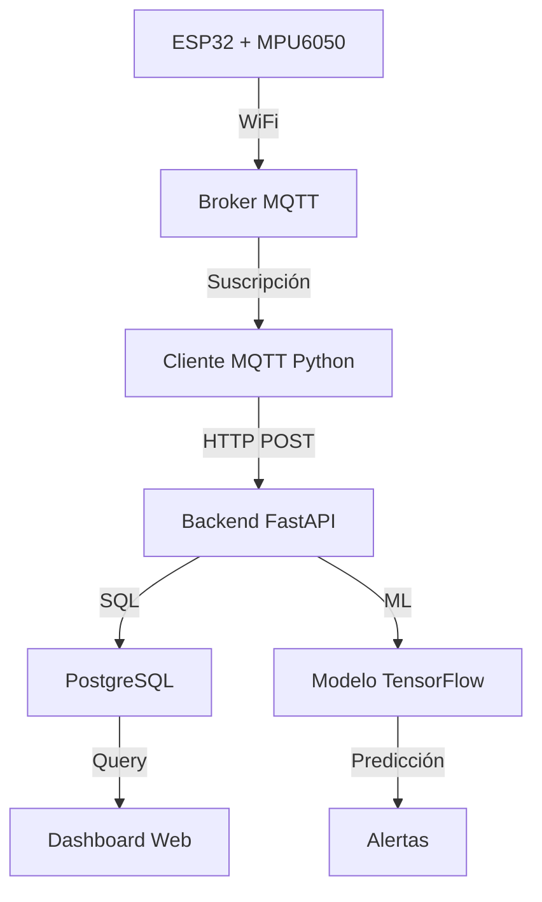

# 🚀 Configuración MQTT para PdM-Manager

Guía completa para configurar el sistema PdM-Manager con comunicación MQTT.

## 📋 Requisitos Previos

### Software necesario:
- ✅ Python 3.8+ 
- ✅ PostgreSQL 
- ✅ DBeaver (para gestión de BD)
- ✅ Arduino IDE
- ✅ Git

### Hardware necesario:
- ✅ ESP32 Development Board
- ✅ Sensor MPU6050
- ✅ Cables jumper
- ✅ Breadboard (opcional)

## 🔌 Conexiones del Hardware

```
ESP32    <-->    MPU6050
GND      <-->    GND
3.3V     <-->    VCC
GPIO21   <-->    SDA
GPIO22   <-->    SCL
```

## ⚡ Configuración Paso a Paso

### 1. 🐍 Preparar el entorno Python

```bash
# Clonar el repositorio (si no lo tienes)
git clone <tu-repositorio>
cd PdM-Manager

# Crear entorno virtual (recomendado)
python -m venv venv
source venv/bin/activate  # Linux/Mac
# o
venv\Scripts\activate     # Windows

# Instalar dependencias
pip install -r requirements.txt
```

### 2. 🗄️ Configurar la base de datos

```bash
# Ejecutar configuración automática
python setup_database.py
```

**¿Qué hace este script?**
- ✅ Crea todas las tablas necesarias
- ✅ Configura sensores por defecto (ID: 1, 2)
- ✅ Configura modelo de ML
- ✅ Crea usuario administrador
- ✅ Establece límites de vibración

**Credenciales creadas:**
- 👤 Usuario: `admin`
- 🔑 Contraseña: `admin123`

### 3. 🔥 Configurar y cargar código al ESP32

#### Instalar librerías en Arduino IDE:
1. Abrir Arduino IDE
2. Ir a `Herramientas → Gestionar Bibliotecas`
3. Instalar:
   - `PubSubClient` (v2.8.0+)
   - `Adafruit MPU6050` (v2.0.0+)
   - `Adafruit Unified Sensor`
   - `ArduinoJson` (v6.19.4+)

#### Configurar placa ESP32:
```
Herramientas → Placa → ESP32 Dev Module
CPU Frequency: 240MHz
Flash Size: 4MB  
Partition Scheme: Default 4MB with spiffs
Upload Speed: 921600
```

#### Cargar código:
1. Abrir `Arduino/ESP32_Sensor/ESP32_Sensor.ino`
2. Verificar WiFi en `credentials.h`:
   ```cpp
   const char* ssid = "TU_WIFI";
   const char* password = "TU_PASSWORD";
   ```
3. Conectar ESP32 al USB
4. Seleccionar puerto correcto
5. Subir código (Ctrl+U)

### 4. 🌐 Iniciar el sistema completo

```bash
# Opción 1: Inicio automático (recomendado)
python start_system.py

# Opción 2: Inicio manual
# Terminal 1: Backend
python -m uvicorn app.main:app --host 0.0.0.0 --port 8000 --reload

# Terminal 2: Cliente MQTT
python mqtt_client.py
```

### 5. ✅ Verificar funcionamiento

1. **Dashboard Web:** http://localhost:8000
   - Login con `admin` / `admin123`
   
2. **API Health:** http://localhost:8000/health
   - Debe mostrar `"status": "ok"`

3. **MQTT Test:** https://hivemq.com/demos/websocket-client/
   - Host: `broker.hivemq.com`
   - Port: `8884`
   - Suscribirse a: `GL_Ingenieros/sensores/vibracion`

4. **Monitor Serial del ESP32:**
   ```
   ✓ Conectado a MQTT
   ✓ DATOS ENVIADOS VÍA MQTT CON ÉXITO
   ```

## 📊 Estructura de datos MQTT

### Tema para datos de sensores:
```
GL_Ingenieros/sensores/vibracion
```

### Formato JSON del mensaje:
```json
{
  "sensor_id": 1,
  "timestamp": "2024-01-15T10:30:45Z",
  "acceleration_x": -0.234,
  "acceleration_y": 9.821,
  "acceleration_z": 0.156
}
```

### Tema para comandos:
```
GL_Ingenieros/sensores/comandos/1
```

**Comandos disponibles:**
- `restart` - Reinicia el ESP32
- `status` - Solicita estado del sensor

## 🔧 Configuración Avanzada

### Variables de entorno para el cliente MQTT:
```bash
export MQTT_BROKER=broker.hivemq.com
export MQTT_PORT=1883
export API_BASE_URL=http://localhost:8000
```

### Configurar HiveMQ Cloud (opcional):
1. Crear cuenta en https://console.hivemq.cloud/
2. Crear cluster gratuito
3. Modificar `credentials.h` en el ESP32:
   ```cpp
   const char* mqttBrokerHost = "tu-cluster.s1.eu.hivemq.cloud";
   const int mqttBrokerPort = 8883;
   const char* mqttUser = "tu_usuario";
   const char* mqttPassword = "tu_contraseña";
   ```

## 📈 Monitoreo y Logs

### Logs del sistema:
```bash
# Cliente MQTT
tail -f mqtt_client.log

# Backend FastAPI  
# Los logs aparecen en la consola
```

### DBeaver - Ver datos en la BD:
1. Conectar a PostgreSQL
2. Navegar a `public.vibration_data`
3. Ver datos en tiempo real

## 🚨 Solución de Problemas

### Error de compilación ESP32 (Watchdog Timer):
```
error: invalid conversion from 'int' to 'const esp_task_wdt_config_t*'
```
**Solución:**
- ✅ El código ya es compatible con ESP32 Core v2.x y v3.x
- ✅ Verifica tu versión: `Herramientas → Placa → Gestor de Tarjetas → ESP32`
- ✅ Actualiza a v3.x para mejor rendimiento
- ✅ O usa v2.0.17 si prefieres estabilidad

### ESP32 no se conecta a WiFi:
- ✅ Verificar SSID y contraseña en `credentials.h`
- ✅ Verificar señal WiFi
- ✅ Reiniciar ESP32

### Cliente MQTT no recibe datos:
- ✅ Verificar que ESP32 envía datos (Monitor Serial)
- ✅ Probar con cliente web de HiveMQ
- ✅ Verificar tema MQTT: `GL_Ingenieros/sensores/vibracion`

### Backend no guarda datos:
- ✅ Verificar que el sensor existe en la BD (sensor_id = 1)
- ✅ Revisar logs del cliente MQTT
- ✅ Probar endpoint: `curl -X POST http://localhost:8000/sensor-data`

### Error de conexión a BD:
- ✅ Verificar que PostgreSQL esté ejecutándose
- ✅ Verificar credenciales en `app/database.py`
- ✅ Ejecutar `python setup_database.py`

## 📱 Uso del Dashboard

1. **Login:** http://localhost:8000/login
2. **Dashboard:** Ver datos en tiempo real
3. **Configuración:** Ajustar límites y modelos
4. **Alertas:** Ver alertas de vibración

## 🔄 Flujo completo de datos



## 🎯 Siguiente Pasos

1. **Cambiar contraseña por defecto**
2. **Configurar múltiples sensores** (cambiar `sensorId` en `credentials.h`)
3. **Personalizar límites de vibración**
4. **Configurar notificaciones por email**
5. **Implementar dashboard personalizado**

---

## 📞 Soporte

Si tienes problemas:
1. Revisar logs del sistema
2. Verificar conexiones de hardware
3. Probar paso a paso cada componente
4. Consultar la documentación de FastAPI y MQTT

¡El sistema está listo para monitorear vibraciones en tiempo real! 🎉