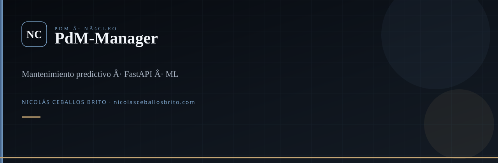
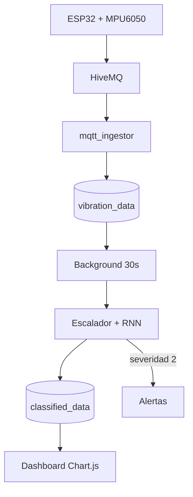

<div align="center">
  
</div>

<br />

<div align="center">

**Núcleo del sistema de mantenimiento predictivo.** Vibra el sensor, clasifica el modelo, avisa el tablero.

[](https://fastapi.tiangolo.com/)
[](https://www.postgresql.org/)
[](https://keras.io/)

</div>

## Qué es

PdM-Manager lee datos crudos de vibración (tabla `vibration_data`, llenada por el ingestor MQTT), corre un RNN Keras + escalador y escribe `classified_data`. Un procesador en background lo hace cada ~30 s. La UI (Chart.js) muestra series, máquinas, sensores y alertas.

Nació en semillero Industria 4.0 / UCP. No es un SaaS público: se corre en lab o LAN.

## Flujo



Severidad: `0` normal · `1` leve · `2` grave (alerta automática).

## Qué hace el código

- JWT en cookie httponly (login / registro)
- CRUD de máquinas, sensores, límites y modelos (`.h5` + `.pkl`)
- `/health` (DB + ML + procesador)
- Ingesta manual `POST /sensor-data` y OpenAPI en `/docs`

## Stack

FastAPI · SQLAlchemy · PostgreSQL · TensorFlow/Keras · scikit-learn · Chart.js · JWT

## Arranque local

```bash
git clone https://github.com/Nico2603/PdM-Manager.git
cd PdM-Manager
python -m venv .venv
.venv\Scripts\activate
pip install -r requirements.txt
copy .env.example .env
uvicorn app.main:app --reload
```

El firmware y el ingestor están en [Arduino-PdM](https://github.com/Nico2603/Arduino-PdM). La investigación de clustering está en [Algoritmos-de-ML-no-supervisados-para-PdM](https://github.com/Nico2603/Algoritmos-de-ML-no-supervisados-para-PdM). El relato del equipo: [PdM_Landing-Page](https://github.com/Nico2603/PdM_Landing-Page).

## Agentes

`.agents/skills/` — Superpowers, `nicolas-identity`, `find-skills`, `fastapi-python`, `machine-learning`. `graphify update .`

---

<div align="center">

**Nicolás Ceballos Brito** · Ingeniero en Sistemas y Telecomunicaciones (UCP 2025)  
CTO · Prosavis · Pereira, Colombia

[nicolasceballosbrito.com](https://nicolasceballosbrito.com)
·
[GitHub](https://github.com/Nico2603)
·
[LinkedIn](https://www.linkedin.com/in/nicolas-ceballos-brito/)
·
[X](https://x.com/NicolasCBrito)
·
[Instagram](https://www.instagram.com/nico_ceballos26/)
·
[Hugging Face](https://huggingface.co/Flackoooo)
·
[Email](mailto:nicolasceballosbrito@gmail.com)

</div>
